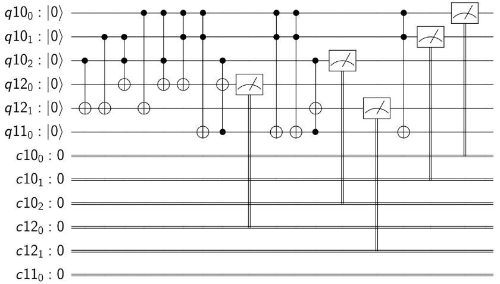

# Adiabatic Gates
Coverting adiabatic equantions to quantum circuits.
The main code is in `qc_generalied.py`.

Implements "Gates for Adiabatic Quantum Computing" ([Warren](https://arxiv.org/abs/1405.2354))

## How to run
1.  Run the provided python code (`qc_generalized.py`) in an environment with pandas, qiskit and matplotlib.
2.  It will ask for the number of qubits and their weights and strengths in the QUBO.
3.  The final qiskit code (`qiskitProgram.py`) will be created in the directory from which the initial python script was run.
4.  To run the circuit: `python3 qiskitProgram.py`.
5.  Give the input values for the qubits: the circuit will execute on the local simulator 1024 times and give the counts of all of the measured outputs.

Basic boolean QUBOs are given in the report (`report3.pdf`). The QUBOs for AND, OR, NOR, NAND, XOR, Half-Adder and Full-Adder are given.

This was originally a group project for NCSU's graduate Quantum Computing course, ECE 592.
